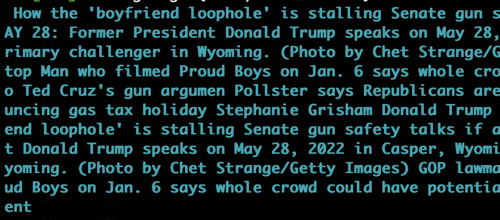

# wordy
Highlights natural text within a document that has other junk.

Just detects common words and applies a smoothing window to 
detect contigious strings of normal words.

Doesn't work perfectly but should be good enough to be useful.

Print text in the terminal that is colored where it is normal text
```
from wordy import wordy
text = wordy.get_test_data(num=2)
h = wordy.Highlighter()
h.highlight(text)
```


Or mask out the junk text with some character

```
h.highlight(text, mask_out='_')
```


Or just remove it

```
h.highlight(text, mask_out='')
```


